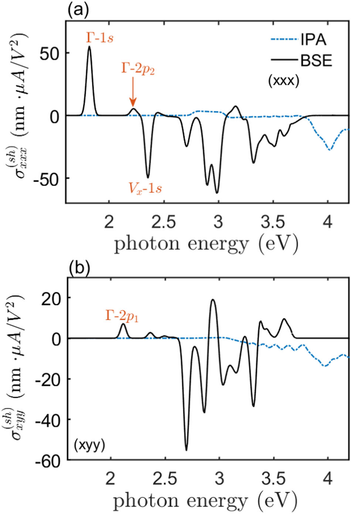

.. OptiX documentation master file

.. _Xatu: https://github.com/xatu-code/xatu

==========================================================
OptiX: linear and nonlinear optics of crystals
==========================================================

**OptiX** (executable: ``opticx``) is a Fortran code that computes the **linear and second-order optical
response of crystals**. It works both in the independent-particle approximation (IPA) and with
**excitonic effects** included. You give it a Wannier90 tight-binding model and, optionally, exciton
eigenstates from `Xatu`_. It evaluates:

* the **linear optical conductivity** :math:`\sigma^{ab}(\omega)`, from which the absorbance follows;
* the **shift conductivity** :math:`\sigma^{abc}(0;\omega,-\omega)`, the bulk photovoltaic (shift-current) response.

Each response comes as a single-particle result and, when Xatu excitons are supplied, as an excitonic
result too. That lets you see directly how the electron–hole interaction reshapes the spectrum.

.. admonition:: Reference paper
   :class: tip

   Citation required when using the code:
   J. J. Esteve-Paredes, M. A. García-Blázquez, A. J. Uría-Álvarez, M. Camarasa-Gómez and J. J. Palacios,
   `Excitons in nonlinear optical responses: shift current in MoS2 and GeS monolayers,
   npj Computational Materials 11, 13 (2025) <https://doi.org/10.1038/s41524-024-01504-2>`_

   Shift conductivity of monolayer GeS computed with OptiX, in the independent-particle
   approximation (IPA) and with excitons (BSE): (a) :math:`\sigma^{xxx}`, (b) :math:`\sigma^{xyy}`.
   Reproduced without modification from J. J. Esteve-Paredes *et al.*, `npj Comput. Mater. 11, 13 (2025) <https://doi.org/10.1038/s41524-024-01504-2>`_, under a `CC BY-NC-ND 4.0 <https://creativecommons.org/licenses/by-nc-nd/4.0/>`_ license.

How a calculation works
=======================

A run is driven by one plain-text input file, and every run follows the same pipeline:

.. code-block:: text

   input file ──► Wannier90 _tb.dat ──► k-mesh and bands ──► optical matrix elements ──► optical response
                  (+ Xatu .eigval/.states)                   (single-particle, excitonic)  (σ(ω) written to .dat)

Computing the optical matrix elements is usually the expensive step. They are stored on disk, so you can
compute them once and then reuse them for different frequency windows or broadenings (see
:doc:`workflows`).

Where to start
==============

.. grid:: 1 2 2 2
   :gutter: 3

   .. grid-item-card:: :octicon:`download` Installation
      :link: installation
      :link-type: doc

      Compiler, OpenBLAS or MKL, and building ``opticx`` on Linux and macOS.

   .. grid-item-card:: :octicon:`rocket` Quick start
      :link: quickstart
      :link-type: doc

      Absorbance and shift current of GeS, and an excitonic calculation for hBN with Xatu.

   .. grid-item-card:: :octicon:`file-code` Input file
      :link: input_file
      :link-type: doc

      Every keyword, its allowed values and defaults.

   .. grid-item-card:: :octicon:`workflow` Workflows
      :link: workflows
      :link-type: doc

      Splitting runs, reusing matrix elements and caching excitonic ones.

   .. grid-item-card:: :octicon:`file` Output files
      :link: outputs/overview
      :link-type: doc

      What each file contains, its columns and units.

   .. grid-item-card:: :octicon:`book` Theory and conventions
      :link: theory/conventions
      :link-type: doc

      Units, broadening, frequency grid, and the formulas behind each response.

.. toctree::
   :hidden:
   :caption: Getting started

   installation
   quickstart
   input_file
   workflows

.. toctree::
   :hidden:
   :caption: Output files

   outputs/overview
   outputs/linear_conductivity
   outputs/shift_conductivity
   outputs/bands
   outputs/matrix_elements

.. toctree::
   :hidden:
   :caption: Theory and conventions

   theory/conventions
   theory/linear_response
   theory/shift_current

.. toctree::
   :hidden:
   :caption: Help and reference

   troubleshooting
   misc/citing
   misc/license
