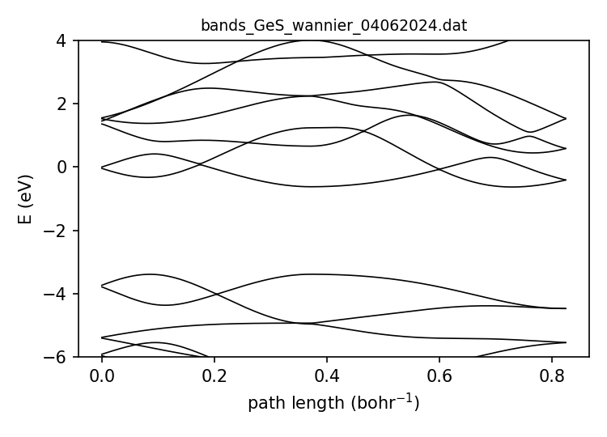

===================================
bands — band structure along a path
===================================

Every run writes ``bands_<material>.dat``: the eigenvalues of the Wannier Hamiltonian along a fixed path
in the Brillouin zone. Use it to check that the model was read correctly, and to pick ``Nfermi`` and
``Bandlist``.

Path
====

The path is fixed. It has 200 points in two straight segments, written in terms of the reciprocal
lattice vectors :math:`\mathbf{G}_1, \mathbf{G}_2`:

.. math::

   \tfrac12\mathbf{G}_1 \;\longrightarrow\; \Gamma \;\longrightarrow\; \tfrac12\mathbf{G}_2

100 points per segment. :math:`\Gamma` is point 100. For a rectangular lattice this is :math:`X \to \Gamma \to Y`. For a hexagonal lattice it is
:math:`M \to \Gamma \to M'`, so the K points are **not** on the path.

The path is built in the plane of :math:`\mathbf{G}_1, \mathbf{G}_2` and only makes sense for 2D systems
whose periodic directions are the first two lattice vectors.

Format
======

One row per k-point:

.. code-block:: text

   kx   ky   kz   s   E_1   E_2   ...   E_norb

``kx ky kz``
   Cartesian k-point in :math:`\text{bohr}^{-1}`. ``kz`` is not set by the path generator and should be ignored.

``s``
   Accumulated path length in :math:`\text{bohr}^{-1}`. Use it as the x-axis.

``E_1 ... E_norb``
   All ``norb`` eigenvalues in eV, in ascending order. Band ``E_Nfermi`` is the highest valence band,
   i.e. ``Bandlist`` entry ``0``. The energies are those of the Wannier90 model, **not** shifted to put
   the Fermi level at zero.

.. code-block:: python

   import numpy as np, matplotlib.pyplot as plt
   b = np.loadtxt("bands_GeS_wannier_04062024.dat")
   s = b[:, 3]
   plt.plot(s, b[:, 4:], "k")
   plt.xlim(s[0], s[-1])
   plt.xticks([s[0], s[99], s[-1]], ["X", "Γ", "Y"])   # ½G1, Γ, ½G2
   plt.ylabel("E (eV)")
