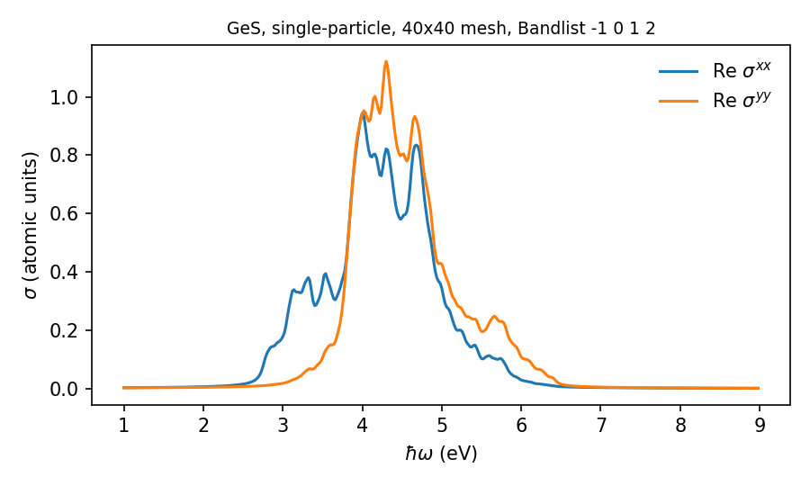
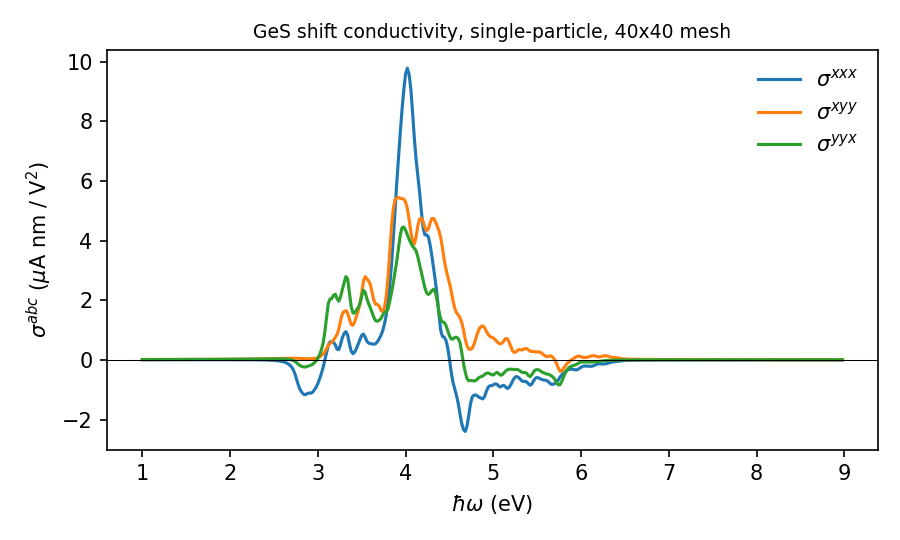
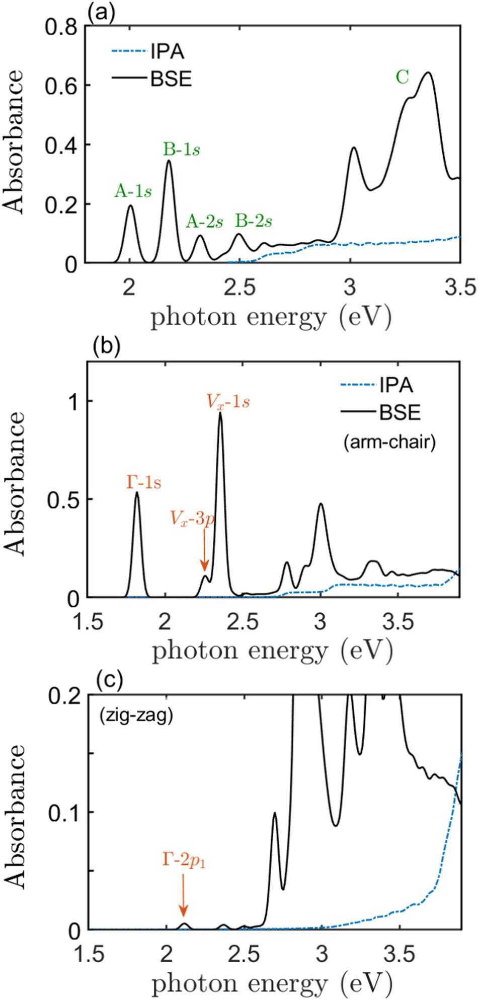

===========
Quick start
===========

OptiX is designed to be a standalone code for computing independent particle approximation (IPA), and a dependency code for excitonic optical responses.

This page walks through four short calculations:

1. the single-particle **linear** conductivity of a GeS monolayer,
2. the single-particle **shift** conductivity of the same system,
3. an excitonic calculation for hBN using exciton states from `Xatu <https://xatu-documentation.readthedocs.io>`_,
4. second-harmonic generation, and a full two-frequency map.

The two Wannier90 models used here ship with the code in ``wannier90_files_input/``. The examples below
assume the code was compiled in ``$OPTICX`` (e.g. ``export OPTICX=$HOME/opticx``).

.. tip::

   The meshes here are small (40x40) so every example runs in seconds on a laptop. That is good enough
   to see the structure of the spectra, but not converged. Production runs for IPA calculations typically use 100x100 or more.

1. Linear conductivity of GeS (independent particles)
=====================================================

Create a working directory and an input file ``input.txt``:

.. code-block:: bash

   mkdir ges_absorbance && cd ges_absorbance

.. code-block:: text

   # Periodic dimensions
   2
   # Wannier90_filename
   ../opticx/wannier90_files_input/GeS_wannier_04062024_tb.dat
   # Xatu_interface
   false
   # Bandlist
   -1 0 1 2
   # Ncells
   40
   # Nfermi
   20
   # OME_sp
   linear
   # Response
   absorbance
   # Energy_variables
   1 9 0.05 400

In words:

* the system is 2D, and the model has 27 Wannier orbitals, 20 of them filled (``Nfermi = 20``);
* the two highest valence bands (``-1 0``) and the two lowest conduction bands (``1 2``) enter the
  calculation;
* the Brillouin zone is sampled with a 40x40 Monkhorst–Pack mesh;
* ``OME_sp = linear`` computes the velocity matrix elements needed for linear response;
* the spectrum runs from 1 eV to 9 eV on 400 points, with a 0.05 eV Lorentzian broadening.

Every keyword is documented in :doc:`input_file`. Run it:

.. code-block:: bash

   ulimit -s unlimited
   export OMP_NUM_THREADS=8
   $OPTICX/bin/opticx input.txt

The program reports each stage as it runs:

.. code-block:: text

    1. Entering parser_input_file
    2. Entering parser_wannier90_tb
    3. Entering parser_optics_xatu_dim
    4. Entering ome
    5. Entering ome_sp
    ...
    8. Entering sigma_first_sp
    The optical response has been evaluated
    Opticx calculation ended

and leaves these files in the directory:

.. code-block:: text

   bands_GeS_wannier_04062024.dat                 # band structure along a default path
   ome_linear_sp_GeS_wannier_04062024.omesp       # single-particle matrix elements (reusable)
   sigma_first_sp_real_GeS_wannier_04062024.dat   # Re σ^{ab}(ω)
   sigma_first_sp_imag_GeS_wannier_04062024.dat   # Im σ^{ab}(ω)

The first column of ``sigma_first_sp_real_*.dat`` is the photon energy in eV. The next nine columns are
the tensor components :math:`xx, xy, xz, yx, yy, yz, zx, zy, zz` in atomic units (see
:doc:`outputs/linear_conductivity`). Plotting columns 2 and 6 gives the absorption along the two
in-plane axes:

.. code-block:: python

   import numpy as np, matplotlib.pyplot as plt
   s = np.loadtxt("sigma_first_sp_real_GeS_wannier_04062024.dat")
   plt.plot(s[:, 0], s[:, 1], label="Re σxx")
   plt.plot(s[:, 0], s[:, 5], label="Re σyy")
   plt.xlabel("ħω (eV)"); plt.legend(); plt.show()

2. Shift current of GeS (independent particles)
===============================================

Second-order responses need more matrix elements: shift vectors, Berry connections and generalised
derivatives. Change two lines of the previous input:

.. code-block:: text

   # OME_sp
   nonlinear
   # Response
   shift

and run again. The new outputs are:

.. code-block:: text

   ome_nonlinear_sp_GeS_wannier_04062024.omesp       # binary, second-order matrix elements
   shift_sp_lengthgauge_GeS_wannier_04062024.dat     # σ^{abc}(0; ω, −ω), 27 components
   shift_vector.dat                                  # shift-vector spectral function (diagnostic)

In ``shift_sp_lengthgauge_*.dat``, column 1 is :math:`\hbar\omega` in eV. The 27 components follow in
:math:`\mu\text{A nm/V}^2`, ordered :math:`xxx, xxy, xxz, xyx, \dots, zzz` (last index fastest). The column of component
:math:`abc` (with :math:`x,y,z = 0,1,2`) is ``1 + 9a + 3b + c`` counting from zero, so:

.. code-block:: python

   h = np.loadtxt("shift_sp_lengthgauge_GeS_wannier_04062024.dat")
   col = lambda a, b, c: 1 + 9*a + 3*b + c
   plt.plot(h[:, 0], h[:, col(0, 0, 0)], label="σ^xxx")
   plt.plot(h[:, 0], h[:, col(0, 1, 1)], label="σ^xyy")

3. Excitonic calculation for hBN (with Xatu)
============================================

To include excitons, first solve the Bethe–Salpeter equation with `Xatu <https://xatu-documentation.readthedocs.io>`_
on **the same Wannier90 model**, then point OptiX to its output.

Step 1 — run Xatu
-----------------

Run Xatu in Wannier90 mode and ask it to write the exciton **energies** (``-e``) and **eigenstates**
(``-c``). Request at least as many states (``-n``) as you plan to use in OptiX:

.. code-block:: bash

   xatu --w90 1 -n 100 -e -c hBN_tb.dat hBN_exciton.in

The number after ``--w90`` is the number of filled bands. **It must equal** ``Nfermi`` **in the OptiX
input.** The band window and k-mesh are fixed in the Xatu exciton file (see the Xatu documentation on input files). OptiX reads both from the Xatu output, so you do not give ``Bandlist`` or
``Ncells`` here.

This produces ``hBN_exciton.eigval`` and ``hBN_exciton.states`` (the names follow your exciton file).

Step 2 — run OptiX
------------------

.. code-block:: text

   # Periodic dimensions
   2
   # Wannier90_filename
   ../opticx/wannier90_files_input/hBN_Pedersen_Zhang_120x120_11_tb.dat
   # Xatu_interface
   true
   ../xatu_run/hBN_exciton.eigval
   ../xatu_run/hBN_exciton.states
   # Exciton_cutoff
   100
   # Nfermi
   1
   # OME_sp
   linear
   # OME_ex
   linear
   # Response
   absorbance
   # Energy_variables
   4.5 12 0.1 400

Notes:

* The two lines after ``true`` are the paths to the ``.eigval`` and ``.states`` files, in that order.
* ``Exciton_cutoff`` is the number of exciton states (lowest in energy) that enter the response.
* ``OME_ex = linear`` builds the exciton optical matrix elements from the Xatu envelopes.

Besides the single-particle files from example 1, this run writes:

.. code-block:: text

   ome_linear_ex_<material>.omeex             # exciton → ground-state matrix elements
   sigma_first_ex_real_<material>.dat         # Re σ^{ab}(ω), with excitons
   sigma_first_ex_imag_<material>.dat

The ``sp`` and ``ex`` files share the same format and frequency grid. Plotting them together shows the
excitonic effects directly.

Here is what a converged comparison looks like (absorbance computed from :math:`\mathrm{Re}\,\sigma^{aa}`,
see :doc:`outputs/linear_conductivity`):

   Linear absorbance of monolayer MoS\ :sub:`2` (a) and monolayer GeS for armchair (b) and zigzag (c)
   polarisation, in the IPA and with excitons (BSE).
   Reproduced without modification from J. J. Esteve-Paredes *et al.*, `npj Comput. Mater. 11, 13 (2025) <https://doi.org/10.1038/s41524-024-01504-2>`_, under a `CC BY-NC-ND 4.0 <https://creativecommons.org/licenses/by-nc-nd/4.0/>`_ license.

For the **excitonic shift current**, use ``nonlinear`` for both ``OME_sp`` and ``OME_ex``, and set
``Response`` to ``shift``. The result goes to ``shift_ex_lengthgauge_<material>.dat``, next
to the single-particle ``shift_sp_lengthgauge_<material>.dat``. Excitonic second-order runs are much
more expensive; :doc:`workflows` explains how to cache the exciton matrix elements between runs.

4. Second-harmonic generation, and a 2D map
============================================

Every second-order process is a branch of one two-frequency expression, so the input differs from the
shift-current one only in ``Response``:

.. code-block:: text

   # OME_sp
   nonlinear
   # Response
   shg
   # Energy_variables
   0.2 4.0 0.05 400

This writes ``shg_sp_lengthgauge_<material>.dat`` (and ``shg_ex_lengthgauge_*`` with Xatu). Remember
that column 1 is the **fundamental** :math:`\hbar\omega`, so a two-photon resonance at :math:`E`
appears at :math:`E/2`.

Swapping ``shg`` for ``electrooptic`` or ``rectification`` gives
:math:`\sigma(\omega;\omega,0)` and :math:`\sigma(0;\omega,-\omega)`. For an arbitrary ratio use
``general`` with ``Frequency_ratio``; adding a second frequency grid turns it into a full map:

.. code-block:: text

   # Response
   general
   # Energy_variables
   0.2 1.8 0.05 320
   # Energy_variables_2
   -1.8 1.8 480

That is 320x480 = 153 600 frequency pairs in one file, with :math:`\omega_1` as the slow index. Its
diagonal :math:`\omega_2 = \omega_1` is SHG and the line :math:`\omega_2 = 0` is the electro-optic
response.

.. warning::

   The anti-diagonal :math:`\omega_2 = -\omega_1` of a map is the rectification, **not** the shift current.
   Use ``Response = shift`` for that. :ref:`dc-limit` explains why.

Where to go next
================

* :doc:`input_file` — every keyword, its allowed values and defaults.
* :doc:`workflows` — splitting a calculation into steps, and reusing matrix elements.
* :doc:`theory/conventions` — units, frequency grid and broadening. Read this before comparing numbers
  with a paper.
* :doc:`theory/second_order` — the two-frequency expression and the branches taken from it.
* :ref:`dc-limit` — the three routes to :math:`\sigma(0;\omega,-\omega)`, and which to trust.
